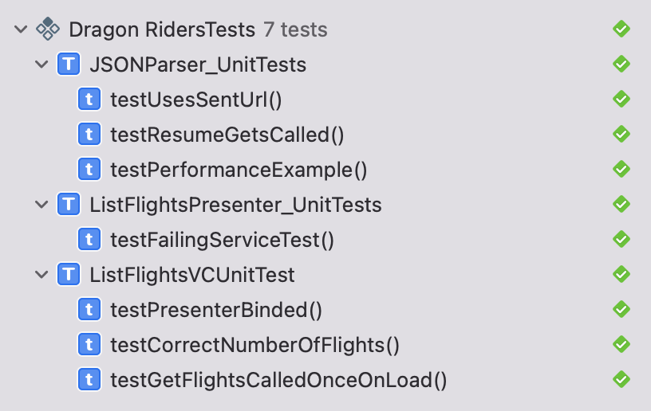
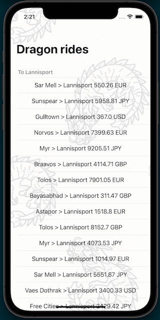

# Dragon Rides!

Imagine a place where dragons are our friends and help us to travel across the kingdom!
Even in such a magical place, we need an app to helping us find Dragon Rides.

## Let's add Unit Tests to this project

## This project showcases
- Model View Presenter Architecture.
- REST API Request with URL Session (No external libraries).
- Swift 5.
- Getting current location with CoreLocation.
- TableView grouped by sections.
- Programmatic UI (No storyboards.)
- Unit Tests.

## Passing unit tests

## Screenshot of the example app

## Author

Andrés Acevedo is an iOS developer from Colombia with more than 10 years of experience developing awesome apps.
